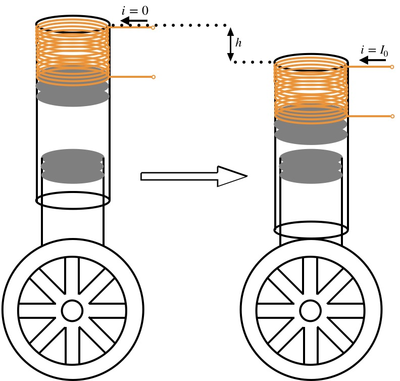

# Bilkent University - Fall 2019 - EEE 351 Best Project
# Electromagnetic Suspension System

# Our Team 
* Berk Yaşar Yavuz ~ https://github.com/berkyavuz1997
* Tuna Alikaşifoğlu ~ https://github.com/tunakasif
* Yiğit Berk Üçüncü ~ https://github.com/ygtbrk3

# Our Project
## INTRODUCTION

In this term project, the aim is to build a system that demonstrates the
fundamental concepts that are covered in the course EEE-351. For this
purpose, a literature review is conducted, in order to come up with a
suitable project proposal. In this process, we came across with the
topic electromagnetic suspension, which fascinated us as a group. Even
though the concept is applicable to various systems from Maglev trains
to Spaceship Launchers, we gravitate to implementation of the system as
a car suspension. Electromagnetic suspension is a system that "provides
both additional stability and maneuverability by performing active roll
and pitch control during cornering and braking, as well as eliminating
road irregularities, hence increasing both vehicle and passenger safety
and drive comfort" [1].

However, this system manages to achieve this task by constantly altering
the strength of a magnetic field via earnest feedback loop, which is too
complex just to demonstrate basic electromagnetics concepts. Thus, we
decided to implement the given system with a passive control mechanism,
i.e., using two repelling magnets placed in a short pipe (see
Fig. <a href="#fig:suspension" data-reference-type="ref" data-reference="fig:suspension">1</a>). In addition, we decided to implement a
circuitry that can adjust the default height of the car; via passing
constant current through the coil that surrounds the aforementioned
pipe, which simulates the suspension of the car. Since the Biot-Savart
law suggests that a constant current through a wire generates a magnetic
field, the specified design will be able to alter the existing magnetic
field to change the distance between the two magnets in the suspension
pipe [2].

<figure>

<figcaption>Designed Suspension System</figcaption>

</figure>

## PROJECT DESCRIPTION

Electromagnetic car suspension system with repulsive magnets as damping
element, along with default height adjustment.

## WORK PLAN

Prior to finalizing the project proposal, a small experiment has been
conducted in order to observe the applicability aspect. By passing
current through a coil, wounded around a screw, we observed the effects
of electromagnetism, which gave us a superficial intuition about the
project. After being convinced that we can manage to achieve the
proposed task, we finalized our proposal and outlined the work plan as
follows.

1.  Theoretically calculate the magnetic field that we can obtain by
    passing current through a solenoid, and the resulting
    attractive/repulsive forces when we put this solenoid in an external
    magnetic field generated by permanent magnets.

2.  Build a test car that can demonstrate the passive suspension effect
    with the repulsive magnets as damping elements.

3.  With additional coils wound to each suspension unit, acquire
    adjustable default height for the car (see
    Fig. <a href="#fig:suspension" data-reference-type="ref" data-reference="fig:suspension">1</a>).

4.  Add a controller to individually control each suspension unit.

Since the following steps will not contribute to the electromagnetics
part of the project, they are kept as optional steps for better
demonstration. Additional implementation steps:

5.  Control suspension height via bluetooth module (OPTIONAL).

6.  Add bluetooth control to the test car (OPTIONAL).

## LIST OF EQUIPMENT

-   Neodymium Magnets

-   Syringes (as suspension pipe)

-   Handmade Solenoids (1 mm Copper Wire)

-   Motor Driver with H-Bridge (LN298N)

-   Motor Driver Shield (L298P)

-   Power Source (Li-Po Battery or Power Supply)

-   Microcontroller (Arduino)

-   Bluetooth Module (HC-05)

-   Toy Car Chassis and Wheels

[1] B. L. Gysen, J. Paulides, J. L. Janssen, and E. A. Lomonova, “Active electromagnetic suspension system for improved vehicle dynamics,” <em>Vehicular Technology, IEEE Transactions on</em>, vol. 59, pp. 1156–1163, Apr. 2010, doi: <a href="https://doi.org/10.1109/TVT.2009.2038706">10.1109/TVT.2009.2038706</a>.

[2] D. K. Cheng, <em>Fundamentals of engineering electromagnetics: Pearson new international edition</em>. Pearson, 2013, pp. 180–182.

